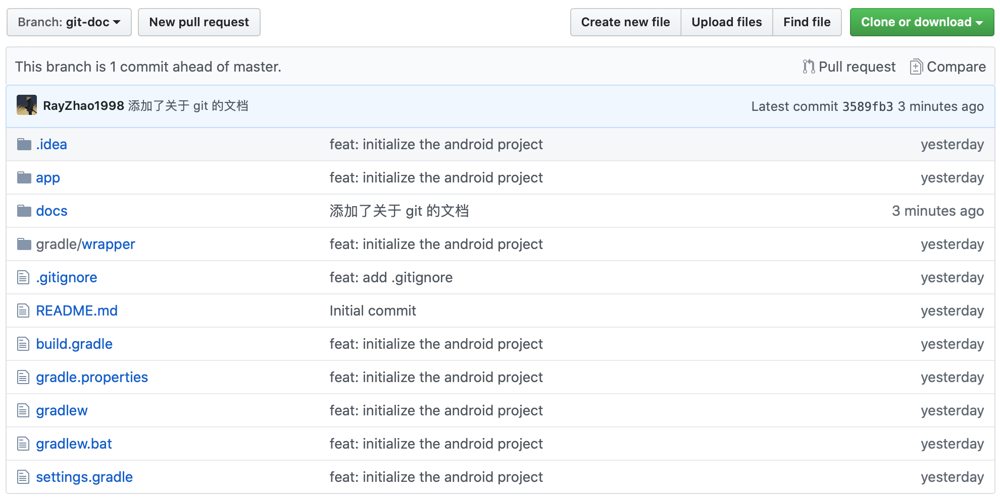

> PS: 以下任何步骤遇到问题可以问我

## 注册 github 账号

> 若你已有 github 账号，请忽略这一条

注册 github 账号即可

## 加入 team

将你的 github 账号用户名或者邮箱发给我，我拉你进 team

## 安装 git

windows 用户可以下载 `git bash`，代替 `cmd` 获得类 linux 命令行的体验

## 克隆项目到本地

首先在 `git bash` 或你其他的类 linux 命令行中（尽量不要用 `cmd`），进入到你想要放置代码的文件夹

然后使用以下命令进行克隆

```
git clone https://github.com/NUAAGraduationDesign-Automaton/Automaton.git
```

然后 `cd` 到 `Automaton` 下进行开发

## 新开一个自己的分支

每个 git 仓库可以有多个分支，使得不同人在同一个项目下互不干扰的进行开发，在你没有做任何操作之前，该项目在 `master` 分支上，这也是我们这个项目最后成品的分支。

每个人可以新建一个分支

```
git checkout -b <你的分支名>
# 举例 git checkout -b zzy-dev
```

该命令会从 `master` 最新的提交记录复制一份出来到你的分支，你可以在你的分支做任何的操作，这些操作不会影像到 `master` 和其他人的分支。

## 当你改完代码需要提交到 github 仓库

比如你修改了 A 文件，或者添加了 B 文件，这时候你使用 `git status` 命令可以查看当前仓库你有哪些为提交的文件修改。

举个例子，我现在这个 `git.md` 是在新建文件夹 `docs` 下的

```
git status

# 下面是命令行的输出
On branch git-doc
Untracked files:
  (use "git add <file>..." to include in what will be committed)

        docs/

nothing added to commit but untracked files present (use "git add" to track)
```

可以看到我新建了一个叫做 `git-doc` 的分支，又一个 `docs` 文件夹的修改没有被提交，需要使用 `git add` 来跟踪

你通过 `git add docs/` 来添加，当有多个文件时，你可以 `git add A B C`，也可以通过 `git add .` 来提交全部

添加完以后再使用 `git status` 查看当前状态，输出如下：

```
On branch git-doc
Changes to be committed:
  (use "git reset HEAD <file>..." to unstage)

        new file:   docs/git.md
```

这时候你需要使用 `git commit` 来提交记录，完成的命令是

```
git commit -m "<这次提交的说明>"

# 比如：git commit -m "添加了关于 git 的文档"
```

这是 commit 后的输出

```
[git-doc 3589fb3] 添加了关于 git 的文档
 1 file changed, 61 insertions(+)
 create mode 100644 docs/git.md
```

提交完以后，你需要提交到远端的 github，需要使用 `git push` 命令，完整的如下

```
# 如果你这个分支之前还没有 push 到远端
git push --set-upstream origin <远端分支名（一般与本地保持一致）>
# 比如：git push --set-upstream origin git-doc

# 如果你的分支之前已经 push 过了
git push
```

这时候你就能在 github 上看到你的分支和提交记录



## git 简易教程推荐

- [廖雪峰的 git 教程](https://www.liaoxuefeng.com/wiki/896043488029600)
- [猴子都能懂的 GIT 入门](https://backlog.com/git-tutorial/cn/)